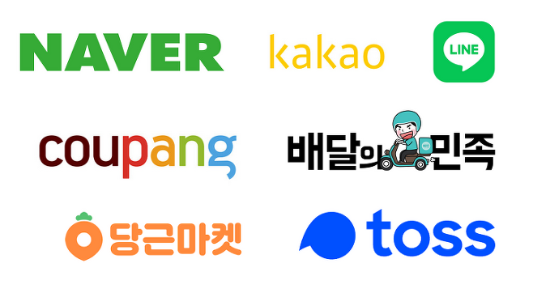

# :roller_coaster: 스프링 스터디

대전 6반 스프링 스터디 그룹입니다.  
**매주 일요일 22:00**에 디스코드에서 스터디를 합니다! 
토론 지향적인 분위기를 추구하고 있습니다. :smile:

## :sparkling_heart:목표기업 :sparkling_heart:
---

  
## :+1: Member
---

 
📌 click 🖼️
<table style="border:1px solid #4444">
<tr> 
<td align="center" width="120px"></td>
<td align="center" width="120px"></td>
<td align="center" width="120px"></td>
<td align="center" width="120px"></td>
    <td align="center" width="120px"></td>
</tr>
<tr style="font-weight:bold">
<td align="center"> LeeDongHo</td>
<td align="center"> ohyr </td>
<td align="center"> EoJin-Kim </td>
<td align="center"> KJY97 </td>
<td align="center"> ChaerinYu </td>
</tr>
</table>
 

---

## :calendar:Schedule
:warning:스터디 계획은 변동될 수 있습니다.   
:truck: ... 은 아직 ...!!!!
    
<table width="550px">
    <thead>
        <tr>
            <th align="center">일시</th>
            <th align="center">주제</th>
            <th align="center">기록</th>
        </tr>
    </thead>
    <tbody>
        <tr>
            <td colspan="3" align="center"><a href="https://www.inflearn.com/course/%EC%8A%A4%ED%94%84%EB%A7%81-%EC%9E%85%EB%AC%B8-%EC%8A%A4%ED%94%84%EB%A7%81%EB%B6%80%ED%8A%B8/dashboard" style="color:black; font-size:15px"><b>스프링 입문 - 코드로 배우는 스프링 부트, 웹 MVC, DB 접근 기술</b></a></td>
        </tr>
        <tr>
            <td rowspan="2" align = "center"> 1주차   2021.08.15.</td>
            <td> 섹션 1. 프로젝트 환경 설정 </td>
            <td align="center" rowspan="2"> 발표자 : 미정   <a href="">스터디 기록</a></td>
        </tr>
        <tr>
            <td> 섹션 2. 스프링 웹 개발 기초</td>
        </tr>
        <tr>
            <td align = "center"> 2주차   2021.08.22.</td>
            <td> 섹션 3. 회원 관리 예제 - 백엔드 개발 </td>
            <td align="center"> 발표자 : 미정   <a href="">스터디 기록</a></td>
        </tr>
        <tr>
            <td rowspan="2"  align = "center"> 3주차   2021.08.29.</td>
            <td> 섹션 4. 스프링 빈과 의존관계 </td>
            <td rowspan="2"  align="center"> 발표자 : 미정   <a href="">스터디 기록</a></td>
        </tr>
        <tr>
            <td> 섹션 5. 회원 관리 예제 - 웹 MVC 개발</td>
        </tr>
        <tr>
            <td rowspan="2"  align = "center"> 4주차   2021.09.05.</td>
            <td> 섹션 6. 스프링 DB 접근 기술 </td>
            <td rowspan="2"  align="center"> 발표자 : 미정   <a href="">스터디 기록</a></td>
        </tr>
        <tr>
            <td> 섹션 7. AOP </td>
        </tr>
        <tr>
            <td colspan="3" align="center"><a href="https://www.inflearn.com/course/%EC%8A%A4%ED%94%84%EB%A7%81-%ED%95%B5%EC%8B%AC-%EC%9B%90%EB%A6%AC-%EA%B8%B0%EB%B3%B8%ED%8E%B8/dashboard" style="color:black; font-size:15px"><b>스프링 핵심 원리 - 기본편</b></a></td>
        </tr>
        <tr>
            <td align = "center"> 5주차   2021.09.12.</td>
            <td> 섹션 1. 객체 지향 설계와 스프링 </td>
            <td align="center"> 발표자 : 미정   <a href="">스터디 기록</a></td>
        </tr>
        <tr>
            <td colspan="3" align="center"> ... </td>
        </tr>
    </tbody>
</table>

---

## :memo: 스터디 방법
* [로드맵](https://www.inflearn.com/roadmaps/373)을 따라서 진행합니다.
* **스터디는 매주 일요일 22:00에 진행합니다.**
* 매주 지정된 분량 공부 후 발표 자료를 만들어 Git에 업로드 합니다.
  * 지정된 분량은 섹션 시간 합이 60' ~ 120'  이내로 합니다.
* 발표자는 스터디 당일 랜덤하게 1명을 추첨합니다.
* 스터디 진행은 디스코드에서 합니다.
* 발표 후 Q&A시간을 갖습니다. 이때 내가 이 챕터를 들으면서 이해 안갔거나, 추가적으로 알았으면 하는 내용을 공유합니다. 
* 그날 해결되지 않은 질문은 질문자가 공부해서 발표합니다.  
 

--- 

## :green_book: 발표 가이드
발표 자료는 PPT, Markdown, Notion 등 제한 없습니다. 
1. 강의 내용 요약
   - :warning:**이 경우 발표자료에 인프런 강의 링크와 해당 강의를 정리한 내용임을 명시해주셔야합니다.** :warning:
2. 심화, 관련 개념   
 

---

## :heavy_exclamation_mark: Git 사용 규칙
- 강의 파일 (*.pdf) 업로드 금지입니다. 
- 해당 주차별로 각자 본인의 Branch를 분기 시켜서 작업 후 merge해주세요.
- 각자의 발표 자료는 하위 폴더로 자신의 깃아이디로 생성 후 넣어주세요.
